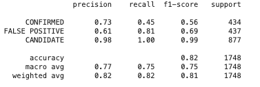
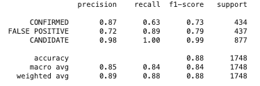

# machine_learning_challenge
## Model used
* SVM
* SVM tuning

## Results
###  **SVM**  
##### Overall Training score: 0.83
##### Overall Testing score: 0.81

   
- The model is very good at predicting CANDIDATE planet, and it has 0.98 precision and 1 for recall. 
- The recall for CONFIRMED is very low (0.45), which means the model can only capture about 45% of true confirmed planet.
- The recall for FALSE POSITIVE is moderate (0.81), which mean it can capture 81% of FALSE POSITIVE planet, but the precision is low in this category (0.61), and it means for all the 81% of planets model thinks if FALSE POSITIVE, 61% of them are true FALSE POSITIVE planet

##### Overall 
- The model is not good at predicting new CONFIRMED OR FALSE POSITIVE planets

###  **SVM Tuning**  
##### Overall Training score: 0.88
##### Overall Testing score: 0.87
##### Gamma: 0.1; C: 1000

   
- The model is very good at predicting CANDIDATE planet, and it has 0.98 precision and 1 for recall. 
- The tuned model increased its precision and recall for both CONFIRMED and FALSE POSITIVE planet prediction. 
- The recall for CONFIRMED still needs to be improve because model only capture 63% of CONFIRMED planet. 

##### Overall 
- The model is improved after tuning, and still needs to be improved for CONFIRMED recall. 

